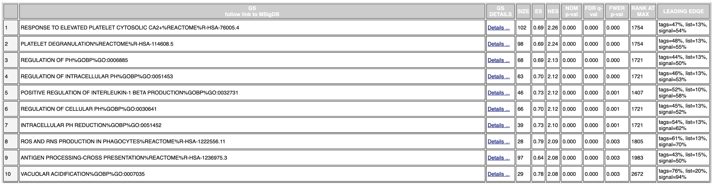
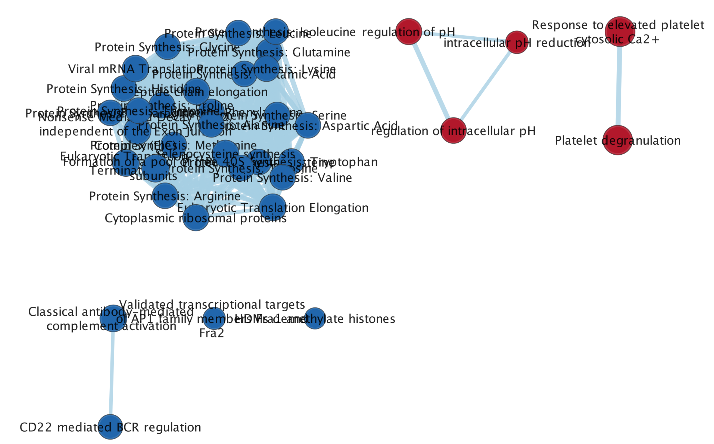
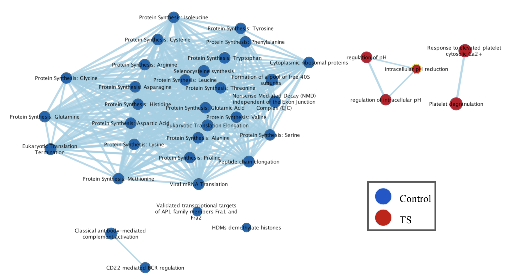
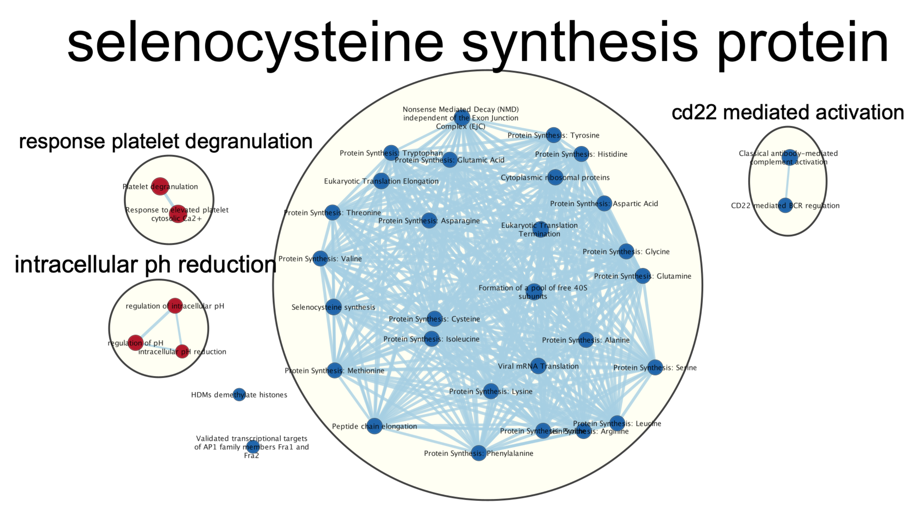
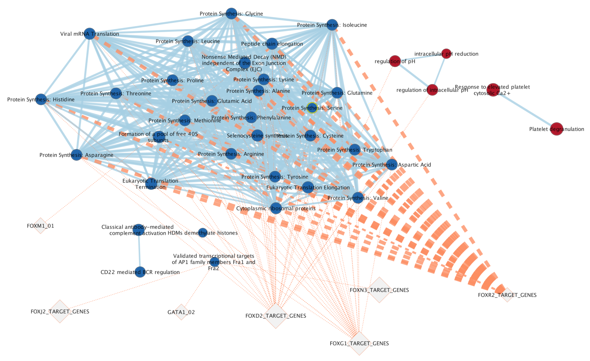

# 0. Libraries
```{r, message=FALSE}
require("RCurl")
require("BiocManager")
require("RCy3")
require("httr")
```

# 1. Introduction
The chosen dataset comes from "Integrated functional genomic analyses of Klinefelter and Turner syndromes reveal global network effects of altered X chromosome dosage" which was published in February, 2020 by Zhang et. al. The GEO ID for this dataset is [GSE126712](https://www.ncbi.nlm.nih.gov/geo/query/acc.cgi?acc=GSE126712). For Assignment 1, we filtered out genes there were not expressed at more than 1 count per million (CPM) in at least 3 samples, and normalized the filtered counts using TMM. For Assignment 2, we conducted differential expression analysis, using `edgeR`, between control individuals and individuals with either Klinefelter or Turner syndrome (KS and TS, respectively). As a reminder, KS occurs in males when they are born with an extra X chromosome (i.e. XXY), while TS occurs in females when they are born missing an X chromosome (i.e. XO). Specifically, we identified differentially expressed genes between males with KS and control males and differentially expressed genes between females with TS and control females. There were 511 genes that were significantly differentially expressed when comparing control males and males with KS. There were 1,998 genes that were significantly differentially expressed when comparing control females and females with TS. A threshold of 0.05 was used for both cases. In this assignment, we conduct non-thresholded gene set enrichment analysis for the females with TS vs. female controls only. 

# 2. Conduct non-thresholded gene set enrichment analysis
## Load the differentially expressed gene tables from Assignment 2
To start this assignment, we first load the list of differentially expressed genes that we generated for Assignment 2.
```{r, message=FALSE}
# create a data folder in the working directory if it is not already there
data_dir <- file.path(getwd(), "data")
if (! dir.exists(data_dir)) {
  dir.create(data_dir)
}

# download the differentially expressed gene list if they have not already been downloaded
gene_table_female_path <- file.path(data_dir, "de_genes_female.rds")

if (!file.exists(gene_table_female_path)) {
  file_url_female <- "https://github.com/bcb420-2024/Vishali_Umaiyalan/blob/main/data/de_genes_female.rds?raw=true"
  download.file(url = file_url_female, destfile = gene_table_female_path)
}

# load in the differentially expressed gene table
gene_table_female <- readRDS(file = gene_table_female_path)$table
```

## Create the ranked list
First, we convert the table of differentially expressed genes into a rank list
```{r}
# make gene name a column 
gene_table_female$gene <- rownames(gene_table_female)

# first calculate the rank
gene_table_female$rank <- -log10(gene_table_female$PValue) * sign(gene_table_female$logFC)

# subset the table to make a ranked list and save the file as a .rnk file
ranked_list_female <- gene_table_female[, c("gene", "rank")]
ranked_list_female <- ranked_list_female[order(ranked_list_female$rank, decreasing = TRUE), ]

colnames(ranked_list_female) <- c("GeneName", "rank")

write.table(ranked_list_female, 
            file = file.path(data_dir, "ranked_list_female.rnk"), 
            sep = "\t", 
            row.names = FALSE, 
            col.names = TRUE, 
            quote = FALSE)
```

## Run GSEA
Next, we will use GSEA to perform non-thresholded gene set enrichment analysis on the ranked lists. We use the baderlab workshop docker image, which comes with GSEA pre-installed at /home/rstudio/GSEA_4.3.2/gsea-cli.sh. 
```{r}
# path to GSEA jar 
gsea_jar <- "/home/rstudio/GSEA_4.3.2/gsea-cli.sh"


female_analysis_name <- "TS_vs_Control"
female_rank_file <- file.path(data_dir, "ranked_list_female.rnk")

# use the March 1st 2024 gmt file from BaderLab
dest_gmt_file = file.path(data_dir, 
                          "Human_GOBP_AllPathways_noPFOCR_no_GO_iea_March_01_2024_symbol.gmt")
if (! file.exists(dest_gmt_file)) {
  gmt_file_url <- "https://download.baderlab.org/EM_Genesets/March_01_2024/Human/symbol/Human_GOBP_AllPathways_noPFOCR_no_GO_iea_March_01_2024_symbol.gmt"
  download.file(url = gmt_file_url, destfile = dest_gmt_file)
}
```

Run GSEA on the females with TS vs. control females
```{r}
command <- paste("",
                 gsea_jar,
                 "GSEAPreRanked -gmx", dest_gmt_file, 
                 "-rnk" , female_rank_file, 
                 "-collapse false -nperm 1000 -scoring_scheme weighted", 
                 "-rpt_label ", female_analysis_name,
                 "  -plot_top_x 20 -rnd_seed 12345  -set_max 200",  
                 " -set_min 15 -zip_report false ",
                 " -out" , data_dir, 
                 " > gsea_output.txt", sep=" ")

if (params$run_gsea) {
  system(command)
}
```

## Analyze GSEA results

Figure 1. The top 10 gene sets returned by GSEA for females with TS from the TS vs. controls analysis. The top term matches with one of the top 10 terms from the thresholded ORA analysis. 


Figure 2. The top 10 gene sets returned by GSEA for female controls from the TS vs. controls analysis. 

1. What method did you use? What genesets did you use? Make sure to specify versions and cite your methods. \
To conduct non-thresholded gene set enrichment analysis, I used the GSEA tool. The genesets I used were from Human_GOBP_AllPathways_noPFOCR_no_GO_iea_March_01_2024_symbol from the BaderLab (@gmt). I provided one ranked list of genes that included all genes (both upregulated and downregulated genes were included, as well as genes not significantly differentially expressed).

2. Summarize your enrichment results. \
My results for TS vs. Controls are summarized in data/TS_vs_Control.GseaPreranked.1712086880477/gsea_report_for_na_pos_1712086880477.html and data/TS_vs_Control.GseaPreranked.1712086880477/gsea_report_for_na_neg_1712086880477.html. The top gene set for TS (pos) was RESPONSE TO ELEVATED PLATELET CYTOSOLIC CA2+, which had a p-value of 0, an FDR value of 0, an ES value of 0.69, and an NES value of 2.24. The top gene in this set was ENDOD1. On the other hand, the top gene set for controls (neg) was 	PROTEIN SYNTHESIS: GLYCINE, which had a p-value of 0, an FDR value of 0, an ES value of -0.66, and an NES value of -2.40. The top gene in this set was RPL36A. 

3. How do these results compare to the results from the thresholded analysis in Assignment #2. Compare qualitatively. Is this a straight forward comparison? Why or why not? \
For the TS vs. female controls experiment, there is overlap between the top 10 terms from the thresholded analysis and the gene sets for TS. Specifically, the top gene set for TS, RESPONSE TO ELEVATED PLATELET CYTOSOLIC CA2+, is also in the thresholded analysis results, and it has the lowest p-value from the REAC source (p-value = 0.0000107). The results from the thresholded analysis are shown under section 8 in Assignment 2. This is not a straight forward comparison because thresholded analysis identifies genes that are significantly differentially expressed between controls and individuals with TS but does not necessarily provide insights into the biological pathways involved. On the other hand, thresholded analysis provides insights into biological processes affected by the TS, even if individual genes in those processes are not all significantly differentially expressed. Since both analyses are quite different, the comparison may not be straight forward.

# 6. Visualize gene set enrichment analysis in Cytoscope

## Launch Cytoscope
```{r}
# does not compile if cytoscape is not running at the same time
# set current_base
if (params$run_cytoscape) {
  
  if (params$is_docker){
    current_base = "host.docker.internal:1234/v1"
    .defaultBaseUrl <- "http://host.docker.internal:1234/v1"
  } else{
    current_base = "localhost:1234/v1"
  }
  cytoscapePing(base.url = current_base)
  cytoscapeVersionInfo(base.url = current_base)
}
```

## Prepare the expression file using the normalized counts from Assignment 1
```{r, message=FALSE}
expression_path <- file.path(data_dir, "controls_vs_ts_expression.txt")

if (! file.exists(expression_path)) {
  counts_path <- file.path(data_dir, "normalized_counts.rds")

  if (! file.exists(counts_path)) {
    counts_url <- "https://github.com/bcb420-2024/Vishali_Umaiyalan/blob/main/data/normalized_counts.rds?raw=true"
    download.file(url = counts_url, 
                  file = counts_path)
  }
  
  # since the original file includes data for the control males vs. males with KS
  # analysis, remove those columns
  original_counts <- readRDS(counts_path)
  columns_to_remove <- grep("(_control_male$|_KS$)", colnames(original_counts))
  counts <- original_counts[, -columns_to_remove]
  
  # have to add gene names as a column so they appear in the txt file
  counts_df <- as.data.frame(counts)
  counts_df$gene <- rownames(counts)
  counts_df <- counts_df[, c(ncol(counts_df), 1:(ncol(counts_df)-1))] # makes gene name the first column
  
  # convert it to a txt file and save it
  write.table(counts_df, 
              file = expression_path, 
              sep = "\t", 
              row.names = FALSE, 
              col.names = TRUE, 
              quote = FALSE)
}
```

## Run Enrichment Map command
```{r}
if (params$run_cytoscape) {
  # defined parameters
  p_value_threshold <- 1
  fdr_threshold <- 0.0001
  
  similarity_threshold <- "0.375"
  similarity_metric = "COMBINED"
  
  gsea_results_file <- file.path(data_dir, 
                                 "TS_vs_Control.GseaPreranked.1712086880477",
                                 "edb",
                                 "results.edb")
  
  # need to replace all the the paths to the host path
  if (params$is_docker) {
    upload_em_file <- function(localPath) {
      bname <- basename(localPath)
      r <- POST(
        url = paste('http://host.docker.internal:1234/enrichmentmap/textfileupload?fileName=', bname, sep=""),
        config = list(),
        body = list(file = upload_file(localPath)),
        encode = "multipart",
        handle = NULL
      )
      content(r,"parsed")$path
    }
    
    # "upload" the files to the host machine and replace each path with the host machine path
    host_expression_path <- upload_em_file(expression_path)
    host_gmt_file <- upload_em_file(dest_gmt_file)
    host_gsea_rank_file <- upload_em_file(female_rank_file)
    host_gsea_results_file <- upload_em_file(gsea_results_file)
  }
  
  current_network_name <- paste(female_analysis_name,
                                p_value_threshold,
                                fdr_threshold,
                                sep = "_")
  
  # build the enrichment map command
  em_command = paste('enrichmentmap build analysisType="gsea" gmtFile=', host_gmt_file,
                     'pvalue=', p_value_threshold,
                     'qvalue=', fdr_threshold,
                     'similaritycutoff=', similarity_threshold,
                     'coefficients=', similarity_metric,
                     'ranksDataset1=', host_gsea_rank_file,
                     'enrichmentsDataset1=', host_gsea_results_file, 
                     'filterByExpressions=false',
                     'expressionDataset1=', host_expression_path,
                     'gmtFile=', host_gmt_file,
                     sep = " ")
  
  # enrichment map command will return the suid of newly created network.
  
  response <- commandsGET(em_command, base.url = current_base)
  
  current_network_suid <- 0
  if(grepl(pattern = "Failed", response)){
    paste(response)
  } else {
    current_network_suid <- response
  }
  
  # check to see if the network name is unique
  current_names <- getNetworkList(base.url = current_base)
  if(current_network_name %in% current_names){
    current_network_name <- paste(current_network_suid,
                                  current_network_name,
                                  sep = "_")
  }
  
  response <- renameNetwork(title = current_network_name,
                            network = as.numeric(current_network_suid),
                            base.url = current_base)
  
}
```

## Analyze Enrichment Map
```{r}
# get the number of nodes
if (params$run_cytoscape) {
  node_response <- GET(paste0(current_base, 
                              "/networks/", 
                              current_network_suid, 
                              "/nodes/count"))
  node_count <- content(node_response)$count
  
  # get the number of edges
  edge_response <- GET(paste0(current_base, 
                              "/networks/", 
                              current_network_suid, 
                              "/edges/count"))
  edge_count <- content(edge_response)$count
  
  print(paste("Number of nodes:", node_count))
  print(paste("Number of edges:", edge_count))
}

```



Figure 3: The initial network map with no manual layout applied. 

1. Create an enrichment map - how many nodes and how many edges in the resulting map? What thresholds were used to create this map? Make sure to record all thresholds. Include a screenshot of your network prior to manual layout. \
There are 37 nodes and 383 edges. The FDR q-value threshold is 0.0001. 

2. Annotate your network - what parameters did you use to annotate the network? If you are using the default parameters make sure to list them as well. \
The default parameters were used to annotate the network. By default, the nodes are annotated with the name of the gene set (from the GSEA results). For the theme network, the nodes were clustered using the default algorithm (MCL Algorithm), and the edge weight column was set to similary coefficient. 

3. Make a publication ready figure - include this figure with proper legends in your notebook.

Figure 4. The final network. 

4. Collapse your network to a theme network. What are the major themes present in this analysis? Do they fit with the model? Are there any novel pathways or themes?
The major themese present in this analysis are selenocysteine synthesis protein, response platelet degranulation, intracellular pH reduction, and CD22 mediated activation. These fit with the model, and there are no novel themes. 


Figure 5. The nodes are clustered using the MCL algorithm to create the theme network. There are 4 themes, and two nodes/gene sets that do not belong to a theme. 

# Interpretation
1. Do the enrichment results support conclusions or mechanism discussed in the original paper? How do these results differ from the results you got from Assignment #2 thresholded methods \
The enrichment results do support conclusions in the original paper (@data) to some extent. For example, the paper mentions that some of the differentially expressed genes are involved in regulation. Similarly, one of the themes/clusters identified in the theme network is CD22 mediated activation. These results are similar from the results we got from the thresholded ORA analysis from Assignment 2. Some of the terms from GSEA overlap with the terms from the g:profiler results. 

2. Can you find evidence, i.e. publications, to support some of the results that you see. How does this evidence support your result? \
There is a publication (@background) that suggests that most of the differentially expressed genes between controls and females with TS are involved with hematologic/immune system or metabolism. This could support the enrichment results since there are terms that relate to the hematologic system such as platelet degranulation and response to elevated platelet cystolic Ca2+. 

3. Add a post analysis to your main network using specific transcription factors, microRNAs or drugs. Include the reason why you chose the specific miRs, TFs or drugs (i.e publications indicating that they might be related to your model). What does this post analysis show?
We conducted a post-analysis of the main network using the transcription factors: FOXM1, FOXJ2, FOXD2, FOXG1, FOXN3, FOXR2, and GATA1. We chose FOXR2 and GATA1 beacuse both of these genes are located on the X chromosome (@tf_background). Since Turner's syndrome decreases X chromosome copy number, these transcription factors might have an important role in the biological pathways that are implicated. While FOXM1, FOXJ2, FOXD2, FOXG1, and FOXN3 are not on the X chromosome, they are in the same transcription factor family as FOXR2, so we decided to include them as well. The resulting network of the post analysis is shown below. 

Figure 6. The network including certain transcription factors. FOXR2 is involved with many of the pathways/gene sets as predicted. On the other hand, GATA1 only interacts with one gene set. 

# References

